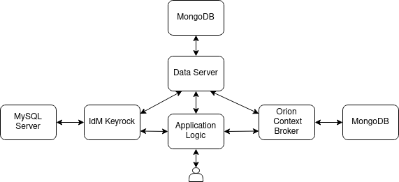

# Film Website

This is an implementation of a website for informing the clients about newly released films. Each user may have one of the following roles:
- Simple User: Can subscribe to films and receive a notification in their homepage on the day of release.
- Cinema Owner: Can add new films and modify information about existing films.
- Administrator: Can manage user information and approve new user requests or delete users.

## Structure of the website

The website is implemented as a composition of multiple services, shown below:



- **Application Logic**: A PHP Apache Server which handles all client requests.
- **IdM Keyrock**: A FIWARE component for identity management, used to manage user roles and passwords, as well as to generate OAuth tokens.
- **MySQL Server**: Required by IdM Keyrock.
- **Data Server**: A PHP Apache Server to manage information about users, films and cinemas by storing them in a MongoDB.
- **Orion Context Broker**: A FIWARE component acting as a publish-subscribe mechanism to produce notifications about newly released films.
- **MongoDB**: One database used by Orion and another by the Data Server.

Each of the services described above is implemented as a Docker container.

## How to run

**Requirements**: You need to have Docker and Docker Compose installed

Simply execute the following commands in a terminal:

```
  $ git clone https://github.com/iapost/film-website
  $ cd film-website
  $ sudo docker-compose up
```
 
Once everything is up and running (may take some time) you can connect to [http://localhost:8080/](http://localhost:8080/) with a web browser (change *localhost* to the IP of the host machine if you connect from a different machine).

The credentials for 3 already initialized users are provided in the table below for testing purposes:

|            | **E-mail**     | **Password** | **Role**      |
|------------|----------------|--------------|---------------|
| **User 1** | admin@mail.com |     admin    | Administrator |
| **User 2** |  own@mail.com  |      own     |  Cinema Owner |
| **User 3** |  user@mail.com |     user     |      User     |

## License

Distributed under the GPL-3.0 License. See [`LICENSE`](LICENSE) for more information.
